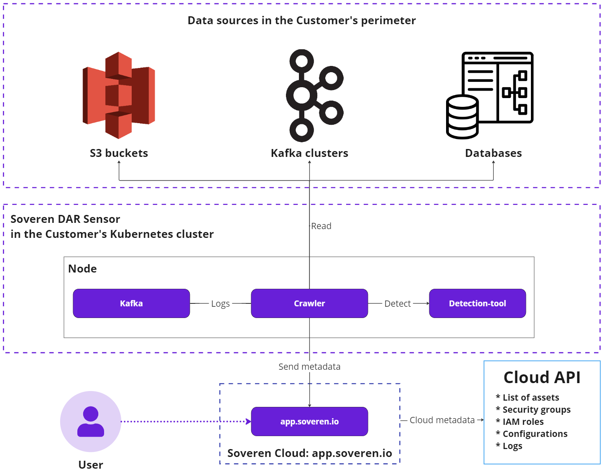

# Soveren Data-at-Rest (DAR) Sensor

Soveren DAR Sensor is specifically [configured](../../administration/configuring-sensor/#dar-configuration) to connect to the Customer’s S3 buckets, Kafka clusters, or database instances.

Soveren DAR Sensor comprises the following parts, they are deployed once per cluster:

* _Crawler_: The core component. _Crawler_ collects samples from data sources, forwards them for detection and sends the resulting metadata to the Soveren Cloud.

* _Detection-tool_ (Detector): Employs proprietary machine learning algorithms to identify data types and gauge their sensitivity.

* _Kafka_: Aggregates logs of task processing by _Crawler_ or _Detector_.

We also employ Prometheus Agent for metrics collection, this component is not shown here.

The Soveren DAR Sensor follows this sequence of operations:

* _Crawler_ connects to the data source and enumerates the contents, such as S3 buckets, Kafka topics, or database tables.

* _Crawler_ then sends the enumeration results to the Soveren Cloud.

* Based on the current enumeration results and previously processed data, the Soveren Cloud forms processing tasks for the _Crawler_. An example of such a task would be analyzing a particular object (e.g. CSV file) in an S3 bucket.

* _Crawler_ processes the tasks received from the Soveren Cloud; specifically, it retrieves data samples from the sources and forwards them to the _Detection-tool_.

* _Crawler_ then collects the detection results and replaces actual values with placeholders (`*` for letters, `1` for digits) while punctuation symbols like commas and special symbols such as `@` remain intact. This approach maintains the value formatting while eliminating all actual data.

* _Crawler_ forms a metadata package, and transmits it to the Soveren Cloud using the gRPC protocol and protobuf.

* The transmission occurs over the connection established and maintained by _Crawler_.

When available, _Crawler_ obtains data source metadata from the cloud provider (e.g. AWS) and sends it to the Soveren Cloud, thus enhancing data comprehensibility in the Soveren app.

Crawler also dispatches a stream of heartbeats from the Soveren DAR Sensor components to the Cloud, in addition to metrics collected from all of them. This provides visibility into the health and performance of the Sensor.