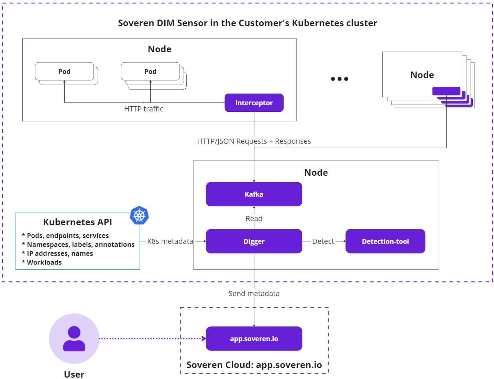

---
hide:
  - toc
---

# Page title
...# Soveren Data-in-Motion (DIM) Sensor

Soveren DIM Sensor intercepts and analyzes structured HTTP JSON traffic. It collects metadata about data flows, identifying field structures, detected sensitive data types, and involved services.

Soveren DIM Sensor comprises several key parts:

* [**Interceptors**](traffic-interception/): Distributed across all nodes in the cluster via a [DaemonSet](https://kubernetes.io/docs/concepts/workloads/controllers/daemonset/), Interceptors capture traffic from pod’s virtual interfaces using a [packet capturing](https://www.tcpdump.org/) mechanism.

* [**Processing and messaging system**](traffic-processing/): This system includes a [Kafka](https://kafka.apache.org/) instance that stores request/response data and a component called Digger which forwards data for detection and eventually sends the resulting metadata to the Soveren Cloud.

* [**Sensitive data detector**](../detection/) (Detector): Employs proprietary machine learning algorithms to identify data types and gauge their sensitivity.

In Kubernetes terms, the Soveren DIM Sensor introduces the following pods to the cluster:

* _Interceptors_: One per worker node.

* _Kafka_: Part of the Processing and messaging system, deployed once per setup.

* _Digger_: The core component of the Processing and messaging system, deployed once per setup.

* _Detection-tool_ (Detector): Deployed once per setup.

We also employ Prometheus Agent for metrics collection, this component is not shown here.

Let's delve deeper into the main components' operations and communications.

The Soveren DIM Sensor follows this sequence of operations:

1. _Interceptors_ collect relevant traffic from pods, focusing on HTTP requests with the `Content-Type: application/json` header.

2. _Interceptors_ pair requests to individual endpoints with their respective responses, creating request/response pairs.

3. _Interceptors_ transfer these pairs to _Kafka_ using the [binary Kafka protocol](https://kafka.apache.org/protocol.html).

4. _Digger_ reads the request/response pair from _Kafka_, evaluates it for detailed analysis of data types and their sensitivity (employing intelligent sampling for high load scenarios). If necessary, _Digger_ forwards the pair to the _Detection-tool_ and retrieves the result.

5. _Digger_ assembles a metadata package describing the processed request/response pair and transmits it to the Soveren Cloud using gRPC protocol and protobuf.

The Kubernetes API provides [pod names and other metadata](k8s-metadata/) to the _Digger_. Consequently, Soveren Cloud identifies services by their Kubernetes names rather than IP addresses, enhancing data comprehensibility in the [Soveren app](https://app.soveren.io/).