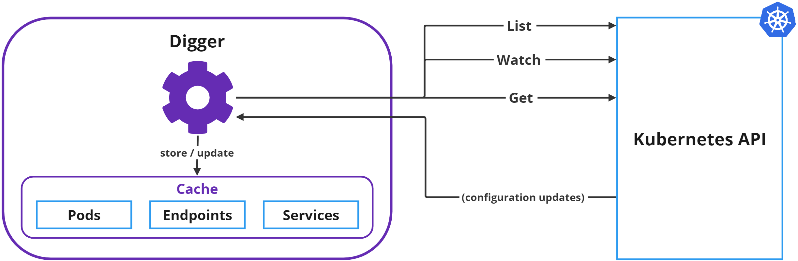

# Retrieving metadata from the Kubernetes API

Digger utilizes the Kubernetes API to gather metadata on these entities: `pods`, `endpoints`, and `services`. This process employs the method depicted as [Efficient detection of changes](https://kubernetes.io/docs/reference/using-api/api-concepts/#efficient-detection-of-changes) in the official K8s documentation.

A dedicated `ServiceAccount` is created. This `ServiceAccount` is given [cluster-wide permissions](https://github.com/soverenio/helm-charts/blob/master/charts/soveren-agent/templates/digger-rbac.yaml) (`ClusterRoleBinding`) to `get`, `list` and `watch` on several `apiGroups`. Digger gets these access rights by using this `ServiceAccount`.

Here's how the communication between Digger and the Kubernetes API is structured:

In more detail:

1. During the initiation phase of the Sensor, Digger conducts three `list` calls to collect initial data on [collections](https://kubernetes.io/docs/reference/using-api/api-concepts/#collections) of `pods`, `endpoints`, and `services`.

2. Subsequently, Digger initiates three `watch` calls, essentially subscribing to notifications about configuration modifications in entities of these three types.

    * In scenarios where the Kubernetes API is unavailable due to any reason, Digger attempts to re-subscribe, with the waiting duration between attempts incrementing exponentially.

    * For the subscription process, Digger employs the `resourceVersion` so that Kubernetes will only transmit new events to it.

3. Upon receiving a new entity in the notifications from Kubernetes, Digger processes the metadata, such as the name, namespace, labels, and annotations, storing these in the cache.

5. Digger also identifies the higher-level Kubernetes construct that created this entity, in other words, the workload resource (such as `DaemonSet`, `ReplicaSet`, or `Deployment`, among others) that serves as the actual owner of this entity. This gives a broader context, for instance, to the pod name (which could be quite cryptic in isolation) of the discovered service.
