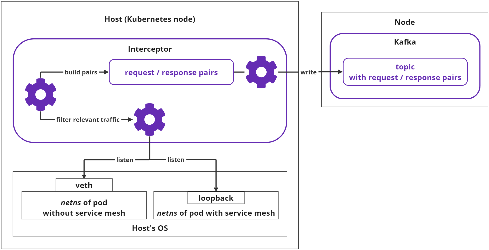

# Interceptors: capturing the traffic

## Overview

The primary objective of Interceptors is to intercept and monitor the network traffic across the nodes within the cluster.

Interceptors are deployed as a [DaemonSet](https://kubernetes.io/docs/concepts/workloads/controllers/daemonset/), and by default, exist as pods on all nodes in the cluster.

Pods with Interceptors have `hostNetwork` set to `true` and run in a privileged mode ([see more on this](../../../administration/securing-sensor/#container-privileges)), granting them access to the host machine. Thus, Interceptors can read data from the host's network namespaces and virtual interfaces using the [PCAP library](https://www.tcpdump.org/).

Interceptors read data from the virtual interfaces in a non-blocking manner. If the host is engaged with higher priority tasks, the OS may limit resources for the Interceptor, possibly resulting in partial traffic coverage.

## Interceptor operation

The simplified flow of each Interceptor's operation is outlined below:

There are several important stages:

* Listening and capturing the HTTP traffic;

* Filtering relevant traffic and assembling request/response pairs;

* Sending request/response pairs for further processing.

### Listening and capturing

* The Interceptor examines the processes operating on the host. It identifies pods and individual containers by associating the IP addresses of their virtual network interfaces.

* Upon inspecting individual container processes, the Interceptor discerns which pods are running service mesh (Istio or Linkerd). If a mesh is detected, the Interceptor initiates monitoring of the container's `loopback` interface to observe unencrypted traffic. If the mesh is absent, the Interceptor monitors the pod's external network interface.

* The Interceptor observes the HTTP traffic of the virtual interface until an entire request or response is compiled. Non-HTTP data is disregarded by the Interceptor.

* If the collected request or response exceeds a predefined size limit (currently 1Mb), it is dismissed and excluded from subsequent analysis.

### Filtering traffic and assembling request/response pairs

* The Interceptor retains the collected request and awaits the response. If the response is delayed, the request is abandoned.

* The combined request/response pair must also not exceed the predefined size limit (1Mb); otherwise, it is discarded.

* During the pair's assembly, the Interceptor verifies the `content-type` from the header, which must be one of the following:

    * `application/json`

    * `application/x-www-form-urlencoded`

* Content types deviating from the above are discarded. At least one half of the pair must have a permissible `content-type` header properly set.

* The following data is deemed irrelevant and excluded from further analysis:

    * Internal Kubernetes or Soveren requests: `UA: kube-probe` and `X-Soveren-Request` headers

    * HTTP errors with codes `301`, `308`, `4xx`, `5xx`

    * Requests to the following URLs: `/metrics`, `/healthz`, `/api/health`, `/api/v2/alive`, `/api/v2/detect`

### Sending request/response pairs for further processing

* The compiled pairs are stored in a buffer. Eventually, the Interceptor forwards them to a dedicated Kafka topic. In this context, Kafka is a standalone component of the Soveren DIM Sensor, an integral part of the [processing and messaging system](../traffic-processing/).

* If Kafka is unavailable for a significant period, the Interceptor purges the buffer, thereby losing some collected data.

* It's worth noting that the traffic volume caused by the Interceptors does not double the original traffic volume. This is due to the fact that much of the traffic passing through the host does not meet the processing criteria. For instance, not all traffic is HTTP with the correct `content-type`, larger payloads are not processed, and technical traffic is disregarded, among other factors. 

## Important considerations

It's crucial to acknowledge that the Interceptors are designed to use as few resources as possible under all conceivable load conditions. In certain extreme scenarios, Interceptors might be completely starved of resources. This might sporadically result in unusual situations, such as an Interceptor failing to connect to the virtual interface because the pod or container has already been terminated (resulting in Kubernetes log errors).

Regardless of how severe the conditions, Interceptors are designed to manage them. If they omit a portion of the captured traffic, or if they occasionally overlook a container or a  pod, the map construction will merely be slightly delayed. 