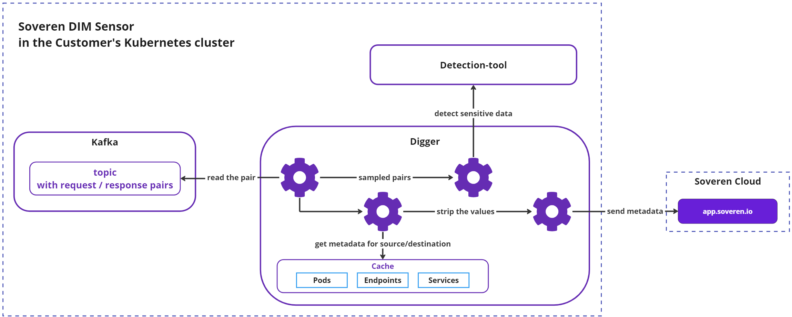

# Digger: traffic processing

## Overview

The incoming traffic is processed by the processing and messaging system, utilizing Kafka as a central hub for message aggregation and Digger, a component developed by Soveren, as the primary logical processor.

Interceptors [write](../traffic-interception/#sending-requestresponse-pairs-for-further-processing) the collected request/response pairs to Kafka. Subsequently, Digger reads these pairs, enriches them with Kubernetes metadata, and forwards samples to the sensitive data detection component to gather detection results. Digger then removes all actual values from the data, replacing them with format-preserving placeholders, and transmits the resulting metadata to the Soveren Cloud.

## Digger operation

The simplified main flow of the Digger is outlined below:

Let's dive into more details of how Digger works:

### Processing of request/response pairs

Multiple goroutines read and process request/response pairs from Kafka topics. Upon completion of the processing for an individual pair and delivery of the resulting metadata to the Soveren Cloud, the goroutine updates the respective offset in Kafka.

Kafka is configured to ensure that it doesn't overflow with data, thereby trimming its topics as needed, contingent on the load and processing resources available.

If Digger detects that the payload was compressed using GZip, it attempts to decompress the data, provided that the resulting data does not exceed the 1Mb limit. If this limit is exceeded, the pair is discarded for safety reasons.

### Processing of source and destination

Digger retrieves the source and destination from the pair and consults a cache containing detailed information for both. This cache is populated separately with the current Kubernetes metadata such as names, namespaces, labels, etc., as explained [here](../k8s-metadata/).

There is no direct communication between Digger and the Kubernetes API during the processing of the source and destination.

### URL clustering, sampling and data detection

While processing a specific URL, Digger attempts to identify the segment representing the resource handle (i.e., a particular resource) and the section of the URL indicating the parameters of that handle (such as the resource identifier). Consequently, the data map may display URLs like `/resource/handle/[id]` or `/resource/[param]/handle`. This process is called URL clustering. It is not universally standardized, hence several heuristics are utilized.

Depending on the workload and, consequently, the volume of request/response pairs, Digger adopts a specific sampling mechanism before forwarding the data. This includes unconditional inspection of each new (previously unseen) URL and occasional sampling of already observed URLs based on the load. In particularly stressful conditions, a URL's data re-evaluation may take up to 6 hours.

After these steps, Digger sends the pair to Detection-tool for data detection and sensitivity inspection, and collects the results. 

### Value substitution

Values within the pair's payloads are replaced with placeholders (`*` for letters, `1` for digits) while punctuation symbols like commas and special symbols such as `@` remain intact. This approach maintains the value formatting while eliminating all actual data.

### Serialization and communication

The processed pair is serialized into protobuf and delivered to the Soveren Cloud via a gRPC connection which is established by Digger. The communication rate is capped at about 10 requests per second. Any data that cannot be sent due to this limit is discarded, with the exception of data relating to previously unobserved URLs, which are sent unconditionally.

#### Transmitting metrics and health checks

Digger also dispatches a stream of heartbeats from the Soveren Sensor components to the Cloud, in addition to metrics collected from all of them. This provides visibility into the health and performance of the Sensor.
