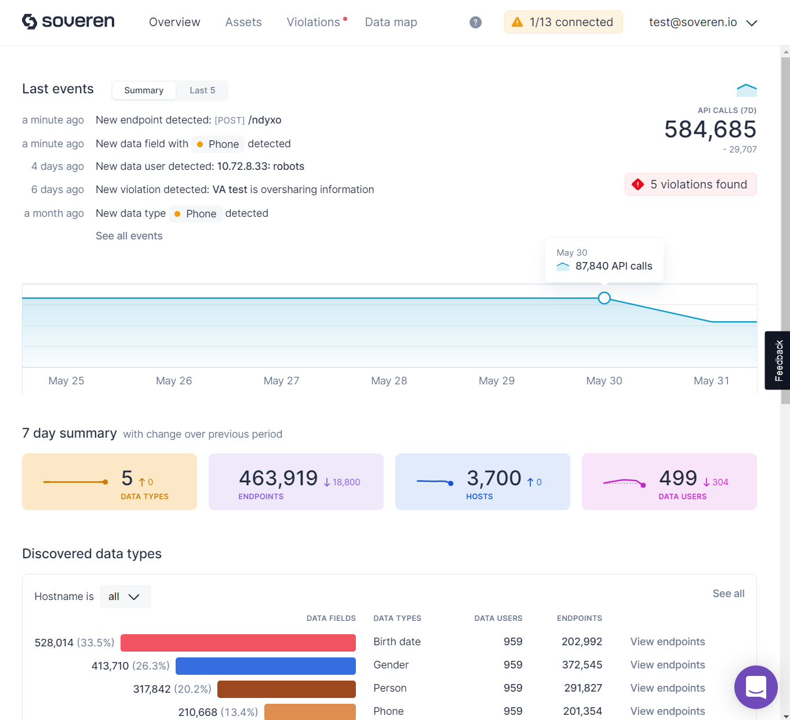

# Introduction

Soveren discovers personally identifiable information, also known as PII or personal data, in structured API flows.

Soveren monitors and parses traffic between the services, identifying personal information along with its sensitivity, with sensitivity graded in accordance with the consequences that might arise if that information was leaked or used inappropriately.
Preconfigured dashboards provide a view into privacy incidents and risks related to PII so that engineering and security leaders can make informed security and privacy decisions.

## How Soveren works

Soveren has a hybrid architecture:

* Soveren Agent is a pre-packaged container installed in your perimeter. It parses structured HTTP JSON traffic, gathers metadata about PII, and sends the metadata to the Soveren Cloud.
* Soveren Cloud is a SaaS managed by Soveren. It provides dashboards to gain visibility into different PII-related statistical data and metrics.

### Soveren Agent

Soveren Agent is deployed on premise and configured to analyze the relevant part of inter-service HTTP API requests and responses that have the `application/json` content type. The Agent processes them asynchronously and gathers metadata about PII from the payloads.

Technically, the Soveren Agent consists of several parts:

* Interceptors which are distributed to all worker nodes of the cluster through the DaemonSet. They capture the traffic from virtual interfaces of the pods with the help of a packet capturing mechanism;
* messaging system ([Apache Kafka](https://kafka.apache.org/)) which receives the data from Interceptors;
* and the Personal Data Detector (or simply Detector) which discovers PII with the help of a custom machine learning algorithms.

Metadata about the requests and responses is collected and sent to Soveren Cloud.
The metadata contains information about how the payload was structured (what fields), which PII types were detected, and which services were involved in the communication.
No part of the actual payload contents is included in the metadata.

### Soveren Cloud

Soveren Cloud is a SaaS managed by Soveren.  It offers a set of dashboards that provide various views into the metadata collected by the Soveren Agent. There are analytics and stats on which PIIs have been observed and how sensitive they were, what services were involved, and what the potential limitations in the API structure were from the privacy standpoint.
