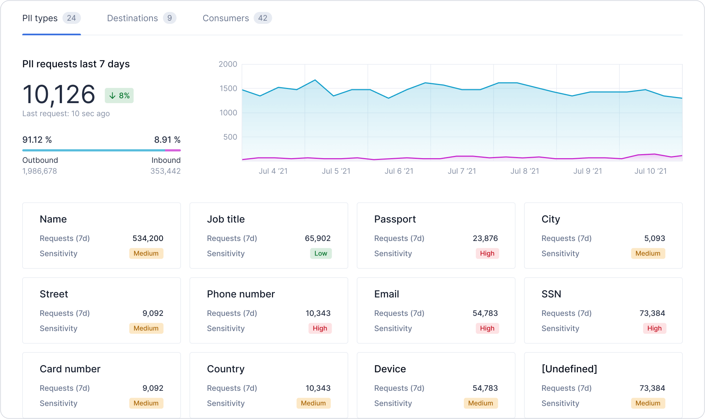
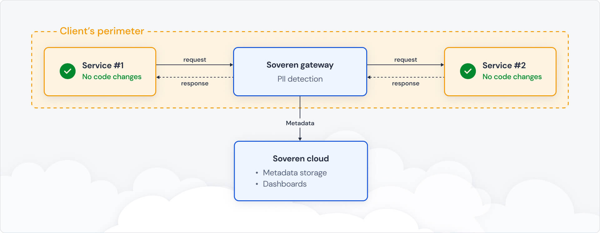
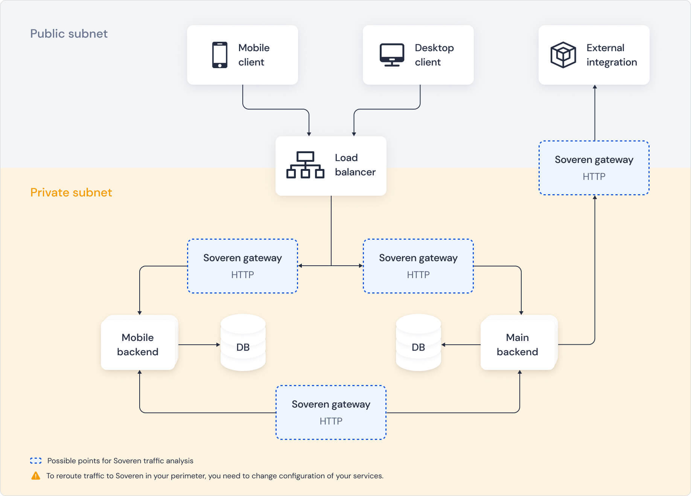

# Introduction

Soveren helps uncover personally identifiable information, also known as PII or personal data, in structured API flows. Throughout this documentation, we will be using PII and personal data interchangeably.

Soveren monitors and parses traffic between the services, identifying personal information along with its sensitivity, with sensitivity graded in accordance with the consequences that might arise if that information was leaked or used inappropriately.
Preconfigured dashboards provide a view into risks related to PII so that engineering and security leaders can make informed security and privacy decisions.

## How Soveren works

Soveren has a hybrid architecture:

* Soveren gateway is a box solution installed in the client’s perimeter. It parses structured HTTP JSON traffic, gathers metadata about PII, and sends the metadata to the cloud.
* Soveren сloud is a SaaS managed by Soveren. It provides dashboards to gain visibility into different PII-related statistical data and metrics.

### Soveren gateway

Soveren gateway is an off the shelf solution. It is deployed on premise as a pre-packaged container and configured to receive the relevant part of inter-service HTTP API requests and responses.
The Gateway then processes those requests and responses asynchronously and gathers metadata about PII from the payloads.

Metadata about the requests and responses is collected and sent to Soveren сloud.
The metadata contains information about how the payload was structured (what fields), which PII types were detected, and which services were involved in the communication.
No part of the actual payload contents is included in the metadata.

Technically, the Gateway consists of a standard proxy (a [Traefik](https://doc.traefik.io/traefik/) fork), messaging system ([Apache Kafka](https://kafka.apache.org/documentation/>)), and analytics component which detects PII based on custom machine learning algorithms.
It may be deployed at different places in the client's perimeter.

### Soveren сloud

Soveren сloud is a SaaS. It is deployed in the cloud by Soveren.
It offers a set of dashboards that provide various views into the metadata collected by Soveren gateway.
That includes analytics and stats on which PIIs have been observed and how sensitive they are, what services are involved, and what are the potential limitations in the API structure from the privacy standpoint.