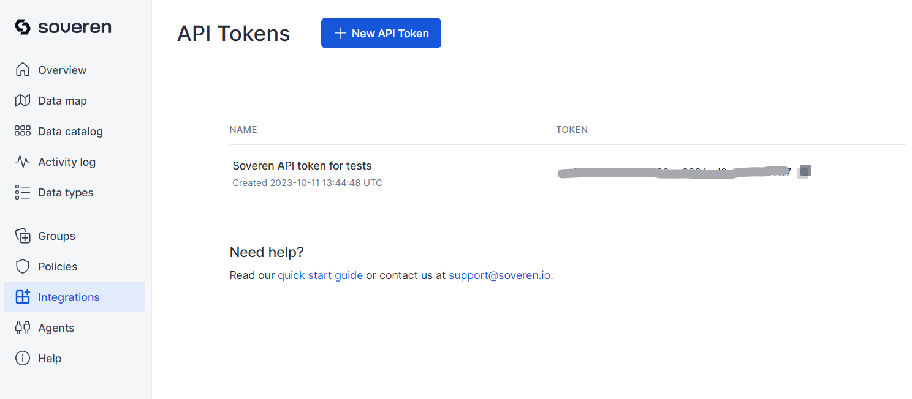

# Object API

## Why use the API

Soveren provides the Object API to allow users to extract information about all discovered assets, the flows between them, and the detected data types.

A popular use case for the Soveren Object API is to automatically keep your inventory updated and enriched with metadata such as live descriptions, service owners, and instances of actual activity (e.g., sending or receiving data). Additionally, you can track real-time data streams between services and pinpoint where sensitive data is detected.

## Connecting to the API

To connect to the Object API, you will need an authentication token. Soveren uses bearer authentication.

To get the token, open the [Integrations in the Soveren app](https://app.soveren.io/integrations/), and press **Manage** on the API Tokens configuration there:

You will be [prompted](https://app.soveren.io/integrations/external-api/) to create new token if you don't have any:

Upon pressing the button, you will need to provide a descriptive name for your new token:

After you've provided the name for the token and pressed Create, you will get the token value:

And the list of tokens will now be non-emtpy:

Now you are all set and can start using the [Soveren Object API](../ref/)!