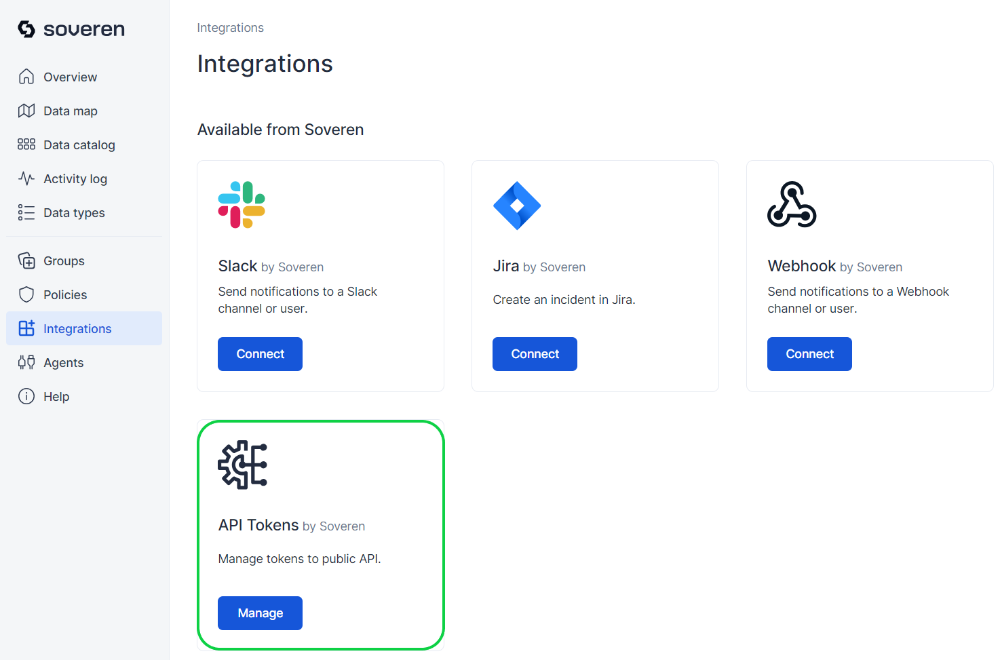
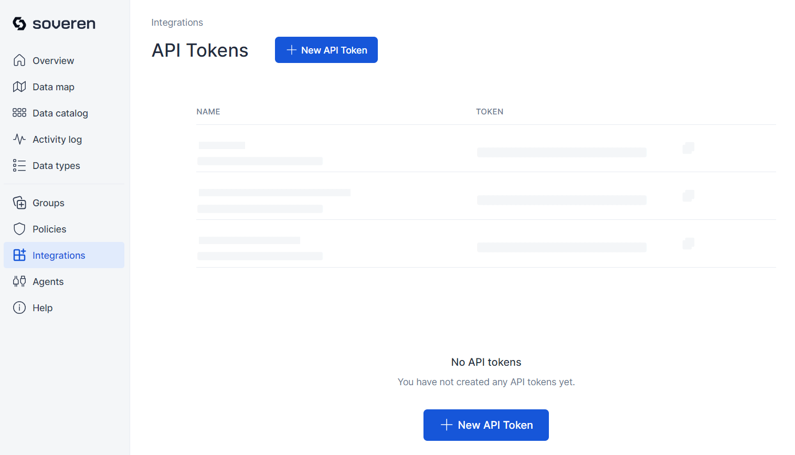
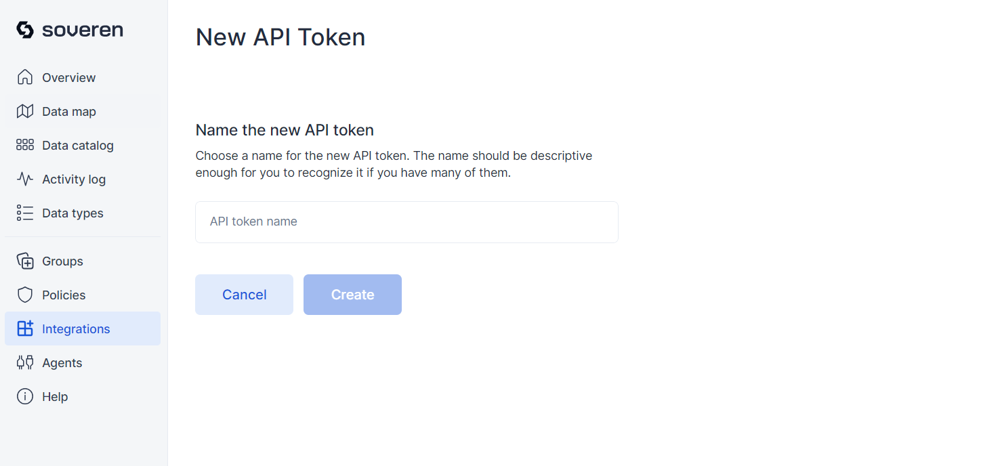
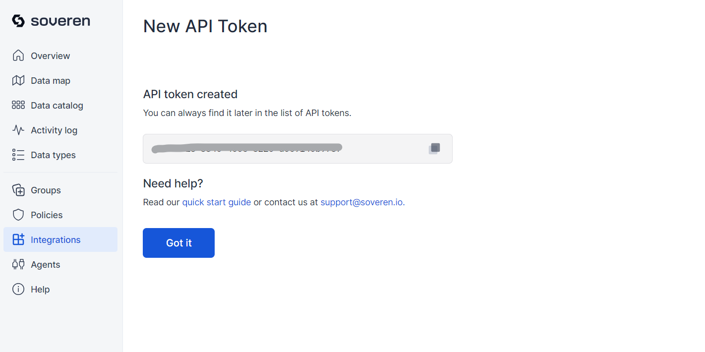
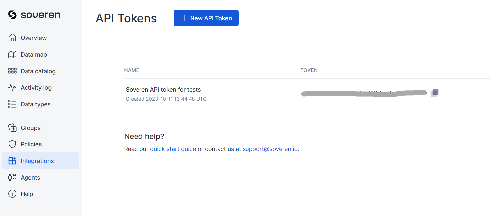
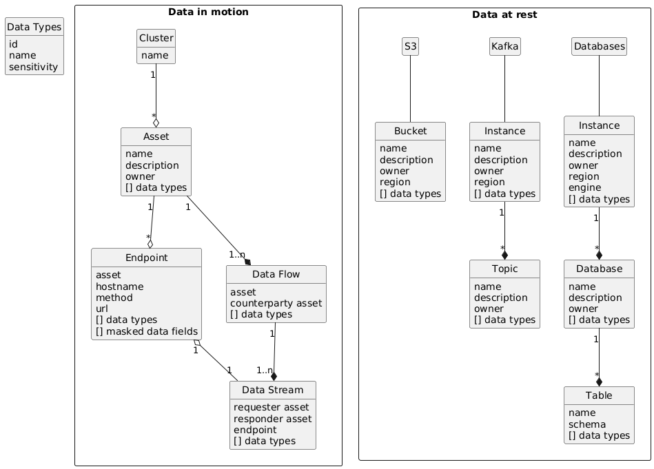
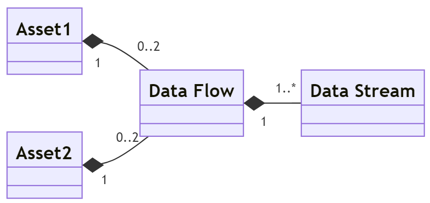

# Object API

## Why use the API

Soveren provides the Object API to allow users to extract information about all discovered assets, the flows between them, and the detected data types.

A popular use case for the Soveren Object API is to automatically keep your inventory updated and enriched with metadata such as live descriptions, service owners, and instances of actual activity (e.g., sending or receiving data). Additionally, you can track real-time data streams between services and pinpoint where sensitive data is detected.

## Connecting to the API

To connect to the Object API, you will need an authentication token. Soveren uses bearer authentication.

To get the token, open the [Integrations in the Soveren app](https://app.soveren.io/integrations/), and press **Manage** on the API Tokens configuration there:

You will be [prompted](https://app.soveren.io/integrations/external-api/) to create new token if you don't have any:

Upon pressing the button, you will need to provide a descriptive name for your new token:

After you've provided the name for the token and pressed Create, you will get the token value:

And the list of tokens will now be non-emtpy:

Now you are all set and can start using the [Soveren Object API](../ref/)!

## Using the API

[Soveren Object API](../ref/) is accessible at [https://api.soveren.io/](https://api.soveren.io/).

Object model which is provided by the API is as follows.

Soveren represents your infrastructure in terms of Kubernetes `clusters` where you deploy Soveren Agents. Each `cluster` is distinguished by its ID and the name you assign to it.

`Assets` refer to deployments that Soveren identifies within the `cluster`. More precisely, they represent an aggregate based on either the source IP or destination IP from web service calls. Although there can be various types of `assets`, currently, Soveren supports only one type, termed "Kubernetes workload."

An `endpoint` is a distinct combination of a hostname, method, and URL discovered on an `asset`.

Communication channels between `assets`, where sensitive `data types` have been detected, are termed `data streams`. For instance, when one `asset` calls another, this establishes a `data stream`.

Multiple `data streams` can exist between two `assets`. If two `assets` share at least one `data stream`, Soveren determines that there's a `data flow` between them.

Between any two chosen `assets`, there can be two `data flows` — one in each direction (from one `asset` to the other and vice versa). A single `data flow` can encompass multiple `data streams`.

For a comprehensive description of each object structure available through the APIs, please refer to the [Soveren Object API](../ref/).