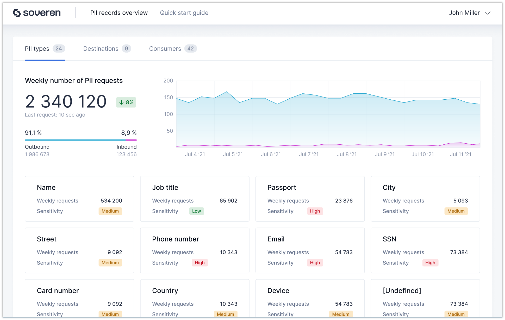

Dashboards
==========

Soveren provides dashboards that give you insights based PII-related metrics and analytics.

Detected PII types their flow:

System APIs involved in PII exchange:

Supported PII types
-------------------
Currently, Soveren supports detection of the following PII types:

* Personal information
   * First Name
   * Last Name
   * Middle name (if any)
   * Date of birth
   * Gender
* National IDs
   * Driver license
   * SSN
* Financial information
   * Card numbers
* Contact information
   * Email
   * Phone number
   * Home address

PII sensitivity model
---------------------

Soveren assigns different weight to PIIs depending on various factors:

* Standalone PIIs
* Combination of different PII types

Classification model roughly has the following sensitivity levels:

* Low — very low possibility of person identification.
* Medium — fair possibility of person identification.
* High — high possibility of person identification.

Standalone PIIs
^^^^^^^^^^^^^^^

Soveren assigns standalone PIIs the following sensitivity levels:

* Low
   * Date of birth
   * Gender
   * IBAN
   * Medical license
* Medium
   * First Name
   * Last Name
   * Middle name (if any)
   * Email
   * Phone number
* High
   * Driver license
   * SSN
   * National ID
   * Travel passport
   * Card numbers
   * Home address
   * NRP (person's nationality, religious or political group)

Combinations of PIIs
^^^^^^^^^^^^^^^^^^^^

Soveren assigns combinations of PIIs the following sensitivity levels:

Work in progress...

