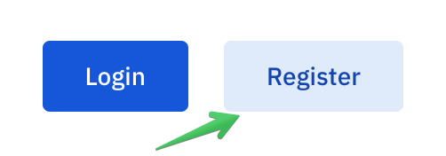

Registering an account
======================

To register a DPO account on Soveren's DPO Portal:

1. Click **Register**.

2. Type in your work email.

3. Create password and type it in.

4. Optionally, subscribe to Soveren's news and updates.

5. Click **Create my account**.

.. image:: images/dpo-portal-registration-screen.png
       :width: 400px

.. tip::
   If you're an independent DPO and have contracts with multiple companies, use the email you normally use for business interactions.

   We recommend you use a complex password. Modern browsers often have built-in password generator. Alternatively, you can google a password generator website.

