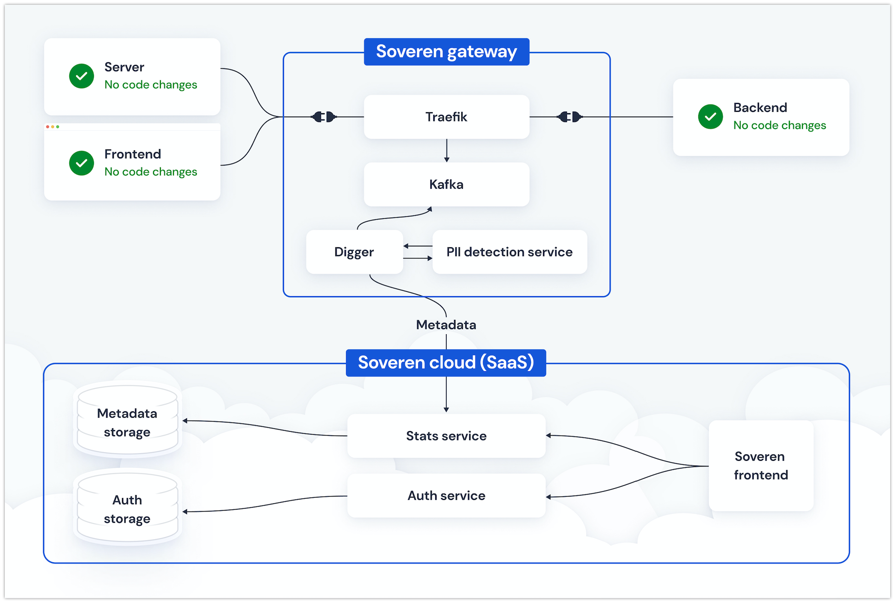

Concepts
========

Basic concepts
--------------
Personally identifiable information (PII) — any representation of information that permits the identity of an individual to whom the information applies to be reasonably inferred by either direct or indirect means.

PII is gaining importance, and regulations appear that set new standards on how PII should be handled and protected, such as GDPR or CCPA.

`General Data Protection Regulation <https://gdpr-info.eu/>`_ (GDPR) — a regulation in EU law on data protection and privacy in the European Union and the European Economic Area.

`California Consumer Privacy Act <https://oag.ca.gov/privacy/ccpa>`_ (CCPA) — a state statute intended to enhance privacy rights and consumer protection for residents of California, United States.

Naturally, we see new emerging data privacy solutions.

Data privacy solution — a complex system to protect client's systems from data breaches, prevent unauthorized access to PIIs, discover and categorize PIIs, assess potential PII-associated risks, and give actionable information to mitigate risks, improve security and help comply with the regulations.

Solution details
----------------

Soveren consists of two parts: Soveren gateway and Soveren cloud.

Soveren gateway
^^^^^^^^^^^^^^^

Soveren gateway is a box solution that lives within your premises, is deployed by you, and implements:

* Proxy
* Messaging system
* PII detection service
* Service for URL clustering and relaying the analysis metadata to Soveren cloud

The proxy extends `Traefik <https://doc.traefik.io/>`_ functionality. It intercepts and routes incoming requests to your system, effectively serving as an edge router.

For the messaging system, Soveren uses `Apache Kafka <https://kafka.apache.org/documentation/>`_. It streams intercepted requests to other Soveren gateway components.

The PII detection service is based on `Presidio <https://microsoft.github.io/presidio/>`_ heavily extending its functionality with new features. It detects PIIs in the intercepted requests.

The URL clustering and metadaya relaying service extends `Digger <https://doc.traefik.io/>`_ functionality. It reads queued requests from Kafka, prepares data in motion for PII detection, sends it to the PII detection service, receives back metadata containing PII detection results, and sends it to Soveren cloud.

Soveren cloud
^^^^^^^^^^^^^

`Soveren cloud <https://github.com/soverenio/saassylives>`_ is a SaaS that lives, unsurprisingly, in the cloud, is deployed by Soveren, and implements:

* Authentication service
* Statistical service
* Frontend with user account, stats and metrics

The frontend implements the user account and dashboard to see a compound risk score, manage PIIs, see APIs and subsystems, receive notifications on important events, and read how to mitigate possible weak points.

How Soveren works
^^^^^^^^^^^^^^^^^

First, the proxy intercepts requests coming to your system.

Then the proxy sends them to the messaging system.

The URL clustering and metadata relaying service reads messages containing requests from the messaging system, prepares them for PII detection, and sends the prepared data to the PII detection service.

The PII detection service receives the prepared data, detects PIIs in it, and sends back metadata containing PII detection results.

The URL clustering service receives the metadata and sends it to Soveren cloud, namely to the statistical service.

The authentication service authenticates the URL clustering service in Soveren cloud.

The statistical service receives the metadata from the the URL clustering service and stores it in the metadata storage.

The frontend asks the statistical service for data to populate the user dashboard whenever a user logs into their user account and views stats and metrics.