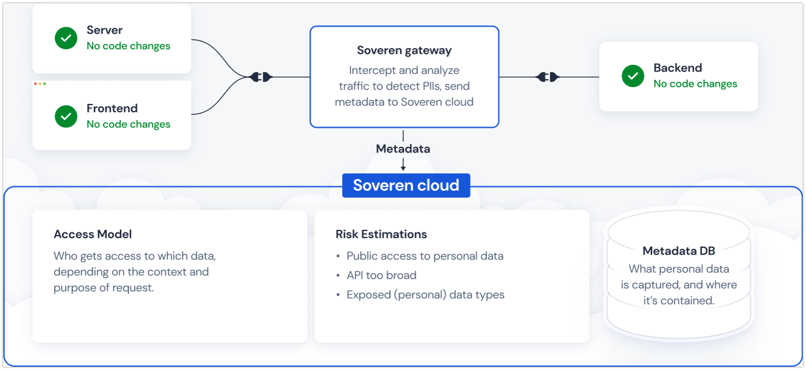

Concepts
========

Basic concepts
--------------
Personally identifiable information (PII) — any representation of information that permits the identity of an individual to whom the information applies to be reasonably inferred by either direct or indirect means.

PII is gaining importance, and regulations appear that set new standards on how PII should be handled and protected, such as GDPR or CCPA.

`General Data Protection Regulation <https://gdpr-info.eu/>`_ (GDPR) — a regulation in EU law on data protection and privacy in the European Union and the European Economic Area.

`California Consumer Privacy Act <https://oag.ca.gov/privacy/ccpa>`_ (CCPA) — a state statute intended to enhance privacy rights and consumer protection for residents of California, United States.

Naturally, we see new emerging data privacy solutions.

Data privacy solution — a complex system to protect client's systems from data breaches, prevent unauthorized access to PIIs, discover and categorize PIIs, assess potential PII-associated risks, and give actionable information to mitigate risks, improve security and help comply with the regulations.

Solution details
----------------

Soveren consists of two parts: Soveren gateway and Soveren cloud.

Soveren gateway
^^^^^^^^^^^^^^^

Soveren gateway is a box solution that lives within your premises, is deployed by you, and implements:

* `Proxy <https://github.com/soverenio/traefik>`_
* `PII detection service <https://github.com/soverenio/detection-tool>`_
* `Service <https://github.com/soverenio/boxy>`_ for URL clustering and relaying the analysis metadata to Soveren cloud

The proxy is a cloud-native application proxy and extends `Traefik <https://doc.traefik.io/>`_ functionality. The proxy is the point to channel your traffic to, and effectively serves as an edge router: door to your platform that intercepts and routes every incoming request.

The PII detection service receives data prepared by the URL clustering service and detects PIIs in it.

The URL clustering and metadata relaying service extends `Digger <https://doc.traefik.io/>`_ functionality. Besides URL clustering, it reads the traffic routed via the proxy, prepares data in motion for PII detection, and sends metadata obtained after PII detection to Soveren cloud.

Soveren cloud
^^^^^^^^^^^^^

`Soveren cloud <https://github.com/soverenio/saassylives>`_ is a SaaS that lives, unsurprisingly, in the cloud, is deployed by Soveren, and implements:

* Authentication service
* Statistical service
* Frontend with user account, stats and metrics

The authentication service authenticates Soveren gateway in Soveren cloud.

The statistical service receives analysis metadata from the box, stores it, and communicates with the frontend to send data to the user dashboard.

The frontend implements the user account and dashboard to see a compound risk score, manage PIIs, see APIs and subsystems, receive notifications on important events, and read how to mitigate possible weak points.

Supported PII types
^^^^^^^^^^^^^^^^^^^
Currently, Soveren supports detection of the following PII types:

* Personal information
   * First Name
   * Last Name
   * Date of birth
   * Gender
* National IDs
   * Driver license
   * SSN
* Card numbers
* Contact information
   * Email
   * Phone number
   * Home address