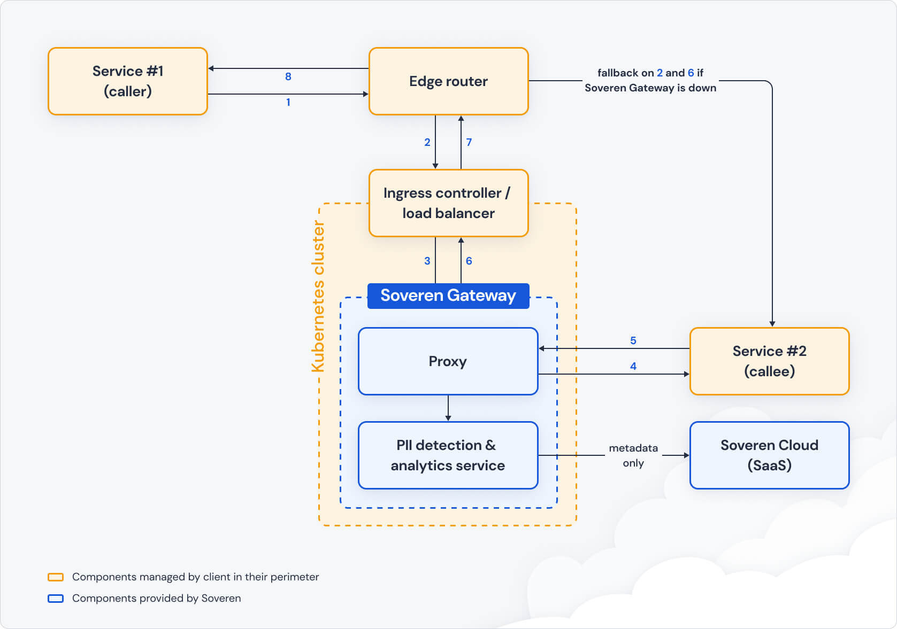

Deployment
==========

Here’s the reference architecture of Soveren deployment:

.. admonition:: Note
   :class: note

   Currently, only Kubernetes deployments are supported. You can implement different approaches including accounting for fallback scenarios if something happens to the Soveren Gateway.

