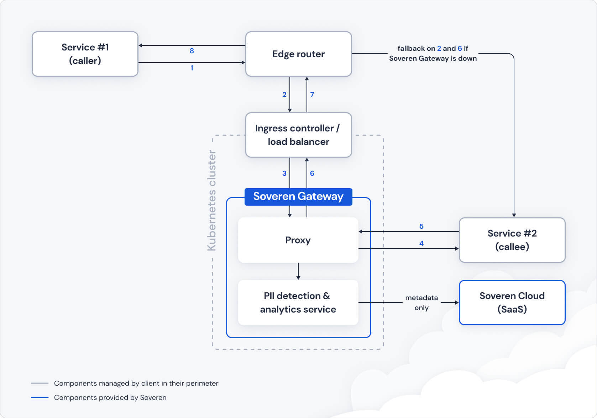

Deployment
==========

Here’s the reference architecture of Soveren deployment.

Currently, only Kubernetes deployments are supported. Through standard K8s and proxy configuration means, you can implement different approaches including accounting for fallback scenarios if something happens to the Soveren Gateway.

