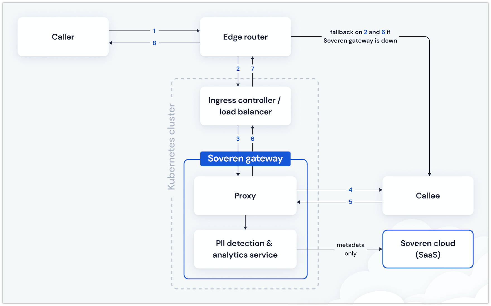

Deployment and fallback
========================

Deployment scheme
-----------------
You know the best your infrastructure and can decide where to deploy Soveren Gateway against your system services and edge router/proxy if you have one.

Below you can see one of the deployment schemes for Soveren Gateway. Mind this is only one of the various options and doesn't include your service layout, so take only as a visual example.

Fallback
--------
Besides a live check, it's a good idea for you to make a fallback plan to automatically reroute your incoming traffic back from the proxy part of Soveren Gateway directly to your services. Use the deployment scheme example above for reference.