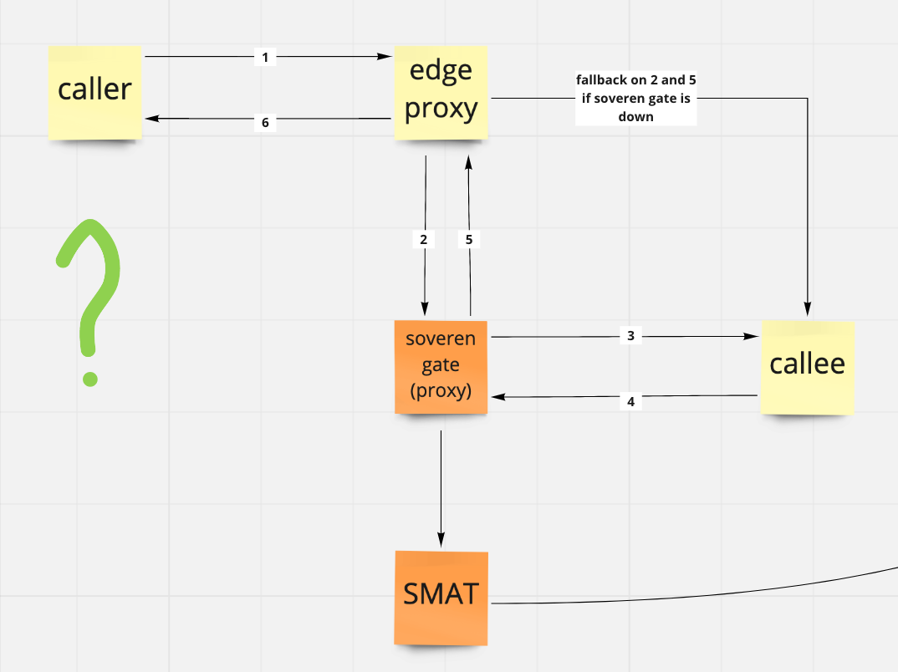

Positioning and fallback
=======================

Positioning
-----------
You know the best your infrastructure and can decide how to position Soveren gateway against your system services and edge router/proxy if you have one.

We're striving to make Soveren stable and available at all times, but any pieces of software can fail from time to time.

It's a good idea to implement some automatic live check to check if the proxy part of Soveren gateway is up and proxies incoming traffic for your system.

Fallback
--------
Besides a live check, it's a good idea for you to make a fallback plan to automatically reroute your incoming traffic back from the proxy part of Soveren gateway directly to your services.

Below you can see one of the positioning options for Soveren gateway. Mind this is only one of the various options and doesn't include your service layout, so take only as a visual example.

