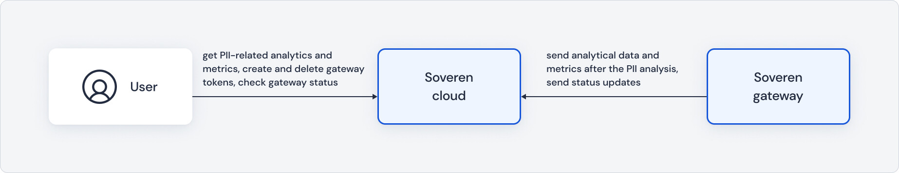
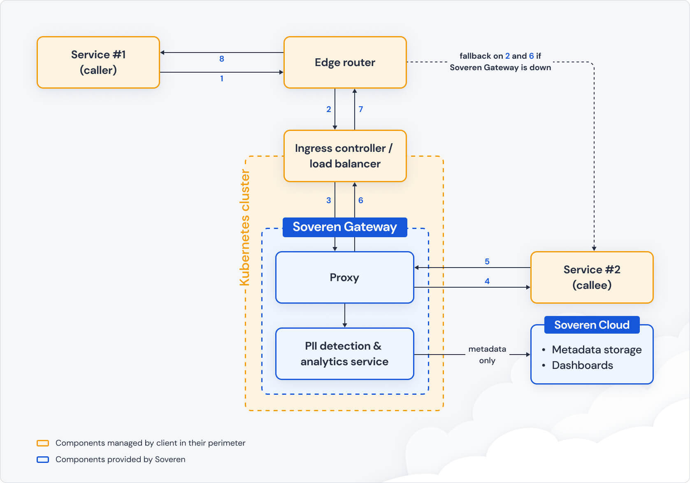

.. raw:: html

    <!-- Google Tag Manager -->
    
    <!-- End Google Tag Manager -->

Integration options
===================

To start solving PII-related problems with Soveren, you need to install Soveren gateway in your perimeter.
And to install it, you need to understand where you want to integrate it — which points in your system you want to monitor and analyze.

Here are possible points where you can integrate Soveren gateway into your perimeter:

.. image:: ../images/architecture/integration-options.jpg
   :width: 900

Before integrating, learn some important caveats:
    * The gateway examines HTTP/HTTPS traffic and supports connection over SSL/TLS.
    * The gateway analyzes only JSON-formatted data in requests/responses body and ignores data in any other formats.

.. admonition:: Tip
   :class: note

   If you're interested in other protocols or data formats, please contact us at support@soveren.io

When integrated, Soveren gateway interacts with Soveren cloud where you can see metrics, analytics and gateway status.

.. admonition:: Note
   :class: note

   No actual client's data is sent to Soveren cloud, only the PII analysis-related metadata.

Close-up examples
^^^^^^^^^^^^^^^^^

To give you a more visual example, here is a Kubernetes-based integration of Soveren gateway:

