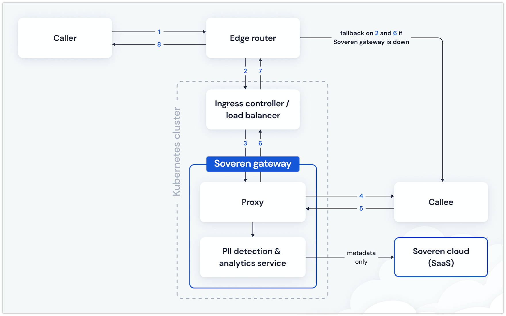

Soveren overview
================

What is Soveren
---------------

Soveren is a data privacy solution that helps uncover personal information (PII) in structured API flows.
Modern companies have a lot of services and heavy on prem traffic flow without much information what PIIs flow between what systems.

Sensitivity of personal information varies depending on many factors. Soveren determines PII sensitivity both for standalone PIIs and combination of different types.

It provides means to assess company risks related to personal information.

How Soveren works
-----------------

Soveren has a hybrid architecture combining on prem and cloud.

The on prem part, *Soveren Gateway*, parses structured HTTP JSON traffic, extracts PIIs, and sends metadata to the cloud.

The cloud part, *Soveren Cloud*, provides dashboards to gain visibility into different PII-related and system-related statistical data and metrics.

Soveren Gateway
^^^^^^^^^^^^^^^

Soveren Gateway is a box solution that is deployed within customer's perimeter, in a K8s cluster.

It gets part of the traffic and detects PIIs in it. Detecting PIIs, it forms metadata with all request details except the actual request payload data.

Architecture-wise, it Soveren Gateway includes:

* A proxy
* A messaging system
* A PII detection service
* A service for URL clustering and relaying the metadata to Soveren Cloud

.. admonition:: Note
   :class: note

   Proxied traffic isn't delayed by PII detection, and Soveren Gateway doesn't increase latency in any significant way.

Soveren Cloud
^^^^^^^^^^^^^

Soveren Cloud is a SaaS hosted in the cloud.

It provides dashboards with insights into all sorts of data privacy related stats and metrics, including compound risk score, information about PII types and system APIs.

Next, proceed with the `installation guide <installation.html>`_.