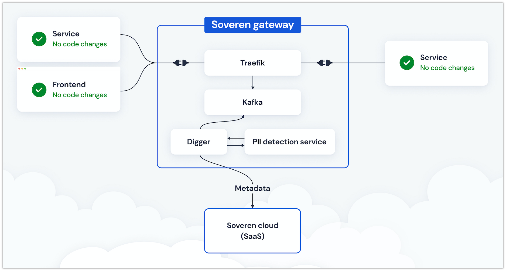

Soveren overview
================

Soveren consists of two parts: Soveren Gateway and Soveren Cloud.

Soveren Gateway
---------------

Soveren Gateway is a box solution that lives within your premises, is deployed by you, and implements:

* Proxy
* Messaging system
* PII detection service
* Service for URL clustering and relaying the analysis metadata to Soveren Cloud

The proxy intercepts and routes incoming requests to your system, effectively serving as an edge router.

The messaing system streams intercepted requests to other Soveren Gateway components.

The PII detection service detects PIIs in the intercepted requests.

Service for URL clustering service reads queued requests from Kafka, prepares data in motion for PII detection, sends it to the PII detection service, receives back metadata containing PII detection results, and sends it to Soveren Cloud.

.. admonition:: Note
   :class: note

   Soveren Gateway doesn't modify proxied requests and sends only metadata to Soveren Cloud.

   Proxied traffic isn't delayed by PII detection, and Soveren Gateway doesn't increase latency in any significant way.

Soveren Cloud
-------------

`Soveren Cloud <https://github.com/soverenio/saassylives>`_ is a SaaS that lives in the cloud, is deployed by Soveren, and implements, besides other services, Soveren frontend.

There you can manage your Soveren account and see a dashboard with compound risk score and various statistical data on detected PIIs, APIs and subsystems.

How Soveren works
-----------------

First, the proxy intercepts requests coming to your system.

Then the proxy sends them to the messaging system.

The URL clustering and metadata relaying service reads messages containing requests from the messaging system, prepares them for PII detection, and sends the prepared data to the PII detection service.

The PII detection service receives the prepared data, detects PIIs in it, and sends back metadata containing PII detection results.

The URL clustering service receives the metadata and sends it to Soveren Cloud.

Other projects Soveren applies
------------------------------

The proxy extends `Traefik <https://doc.traefik.io/>`_ functionality.

For the messaging system, Soveren uses `Apache Kafka <https://kafka.apache.org/documentation/>`_.

The PII detection service is based on `Presidio <https://microsoft.github.io/presidio/>`_ heavily extending its functionality with new features.

The URL clustering and metadata relaying service is our own creation.