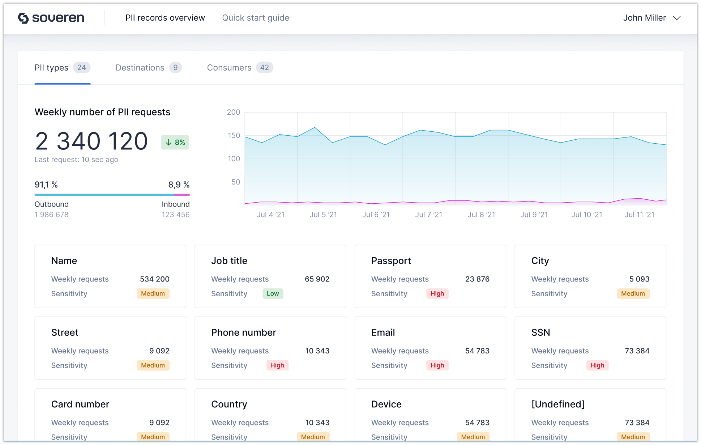

Quick start guide
=================

Here’s what you need to get started with Soveren:

.. admonition:: Tip
   :class: tip

   Currently, Soveren gateway available for installation in your Kubernetes cluster. For other deployment options contact us at support@soveren.io.

1. Register
^^^^^^^^^^^

Register a new `Soveren account <https://soveren.io/sign-up>`_.

2. Copy token
^^^^^^^^^^^^^
Go to your `account settings <https://soveren.io/account/api-key>`_, find and copy your Soveren token.

3. Add token to K8s cluster
^^^^^^^^^^^^^^^^^^^^^^^^^^^
Add the token key to the Kubernetes cluster:

::

     kubectl create secret generic soveren-proxy-token --from-literal=token=<soveren-token-from-your-account-on-soveren.io>

4. Apply configuration
^^^^^^^^^^^^^^^^^^^^^^
Apply Soveren Gateway configuration using the preconfigured manifest file:

::

     kubectl apply -f https://github.com/soverenio/smat/<path-to-the-manifest-file>

5. Сonfigure Soveren Gateway to proxy traffic
^^^^^^^^^^^^^^^^^^^^^^^^^^^^^^^^^^^^^^^^^^^^^
Сonfigure Soveren Gateway to proxy traffic for your services: edit the ``replicator`` ConfigMap and set the ``url`` parameter in the section ``services`` to point to your service:

::

     kubectl edit cm replicator

``replicator`` ConfigMap example:

::

       # Add the service
       services:
         test-service:
           loadBalancer:
             servers:
               - url: http://address-of-your-service:port/

.. admonition:: Tip
   :class: tip

   You can add multiple instances of the same service adding more lines with the ``url`` parameter.

   For routing incoming traffic to multiple services of different types, read the `routing section of Traefik docs <https://doc.traefik.io/traefik/routing/overview/>`_.

6. Configure your service(s)
^^^^^^^^^^^^^^^^^^^^^^^^^^^^^^^^^^^^^^^^^^^^^^^^^^^^^^^^^^^^^^^^
Configure your service(s) to route traffic to Soveren Gateway.

Nobody knows your infrastructure like you. Decide where to deploy Soveren Gateway against your system services and edge router/proxy if you have one. Take the example deployment scheme below as a reference and remember this is only one of the various options and doesn't include your service layout.

.. admonition:: Tip
   :class: tip

   Read `Fallback plan <fallback.html>`_ for emergency cases.

7. Check the dashboard
^^^^^^^^^^^^^^^^^^^^^^

`Go to the dashboard <link-to-soveren-dashboard>`_ and check the PIIs detected in your traffic and your compound risk score.

