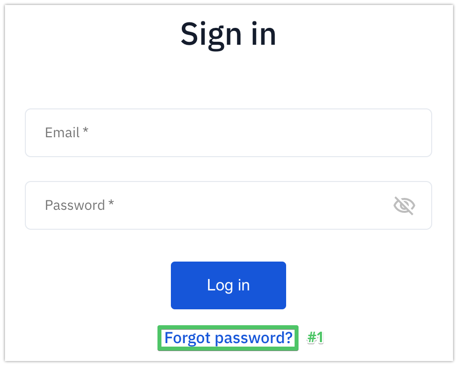
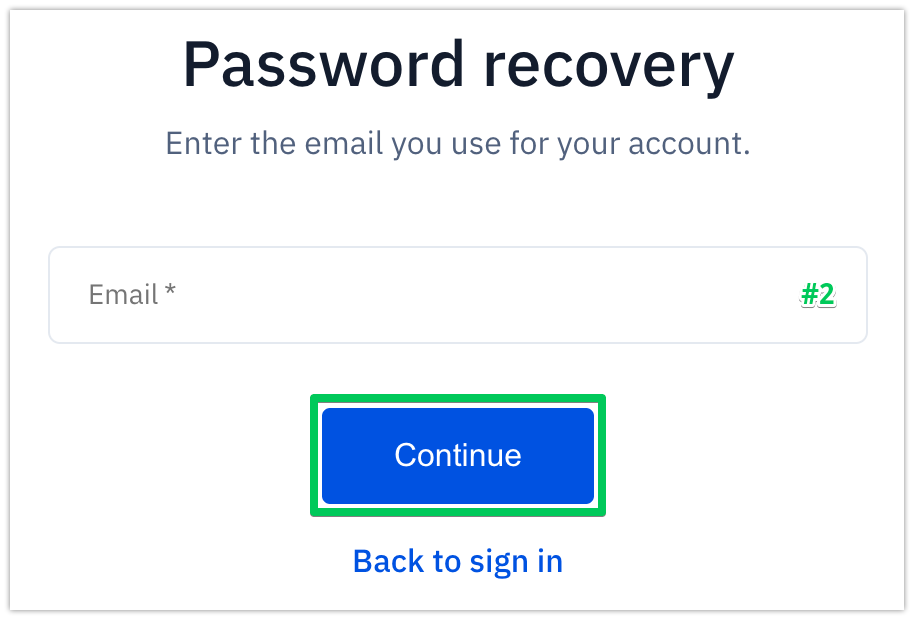

Recovering password
===================

To recover password to a DPO account on Soveren's DPO Portal:

1. Click **Forgot password?** on the sign-in page to get to the password recovery page.

2. Type in the email you registered with and click **Continue**.

3. On the next page, read the recovery message, and proceed to recovering your password:

   * Click **OK** to return to soveren.io home page or close the page.

   * Open your work email, check for a letter containing the password recovery link.

     Click the link to get to the password recovery page.

   * On the recovery page, set a new password and click **OK**.

