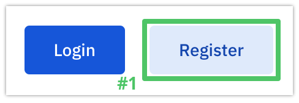
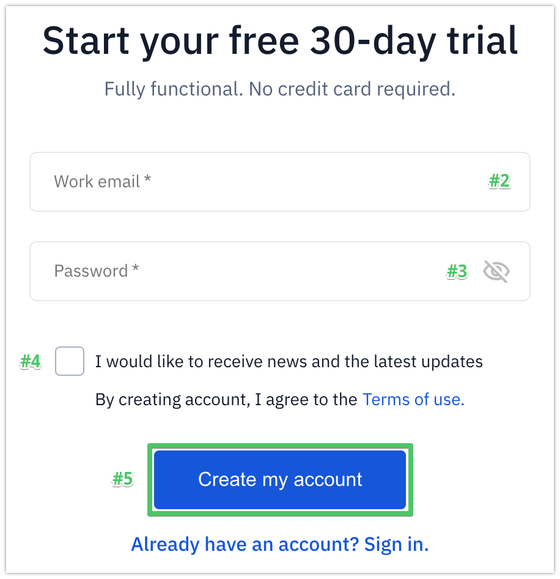
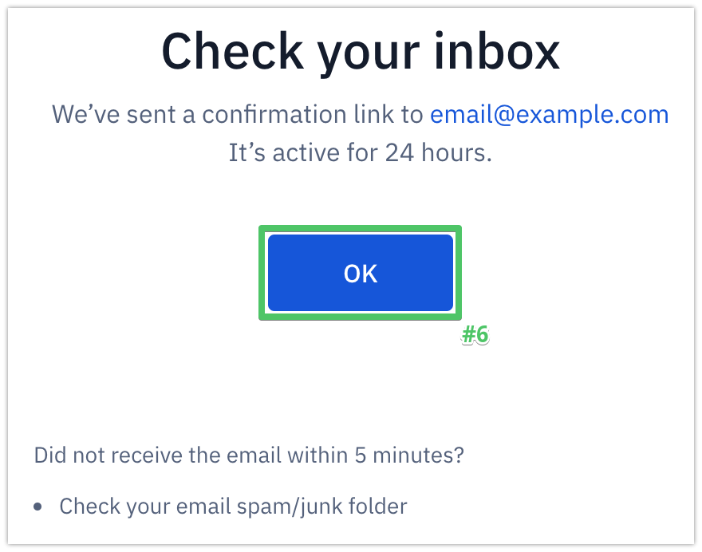

Registering an account
======================

To register a DPO account on Soveren's DPO Portal:

1. Open |dpo_portal_link| and click **Register** to open the registration page.

2. Type in your work email.

.. tip::
   If you're an independent DPO and have contracts with multiple companies, use the email you normally use for business interactions.

3. Create password and type it in.

.. tip::

   We recommend you use a complex password. Modern browsers often have a built-in password generator. Alternatively, you can google a password generator website.

4. Optionally, subscribe to Soveren's news and updates.

5. Click **Create my account**.

6. On the next page, read the success message, and proceed to confirm your registration:

   * Click **OK** to return to soveren.io home page or close the page.

   * Open your work email, check for a letter containing the confirmation link, click the link to confirm your registration.

.. warning::

   Make sure to confirm your registration within the next 24 hours after registering an account.

   All unconfirmed account are removed in 24 hours.

.. |dpo_portal_link| raw:: html

   <a href="https://dpo.soveren.io/" target="_blank">dpo.soveren.io</a>

