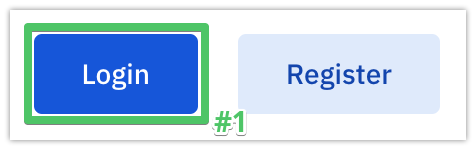
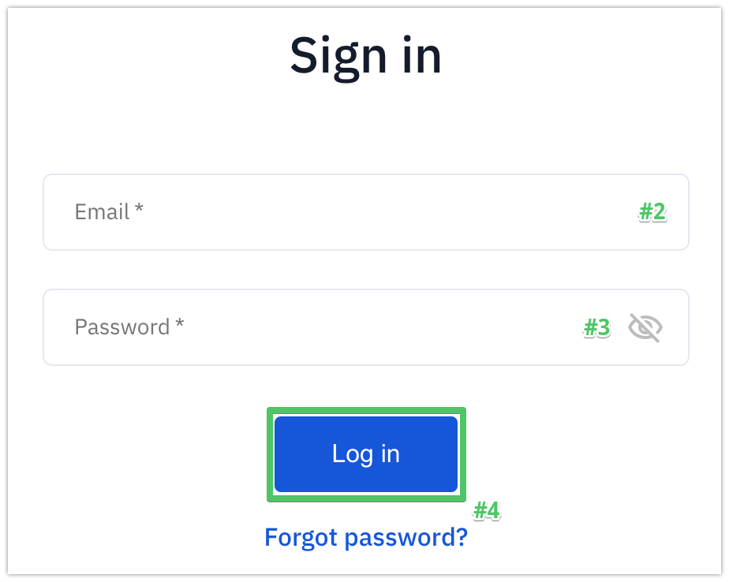

Signing in to an account
========================

To sign in to a registered DPO account on Soveren's DPO Portal:

1. Open |dpo_portal_link| and click **Sign in** to open the sign-in page.

2. Type in the email you registered with.

3. Type in your current password.

.. tip::

   We recommend you use a complex password and change your current password if it's weak. Modern browsers often have a built-in password generator.

   Alternatively, you can google a password generator website. Modern browsers also often have a secure password manager, so you don't have to remember all your passowords.

4. Click **Sign in**.

.. |dpo_portal_link| raw:: html

   <a href="https://soveren.io/" target="_blank">soveren.io</a>

.. tip::

   Forgot your password? |password_recovery_instructions|.

.. |password_recovery_instructions| raw:: html

   <a href="https://docs.soveren.io/recover-password.html" target="_blank">Read how to recover your password</a>

